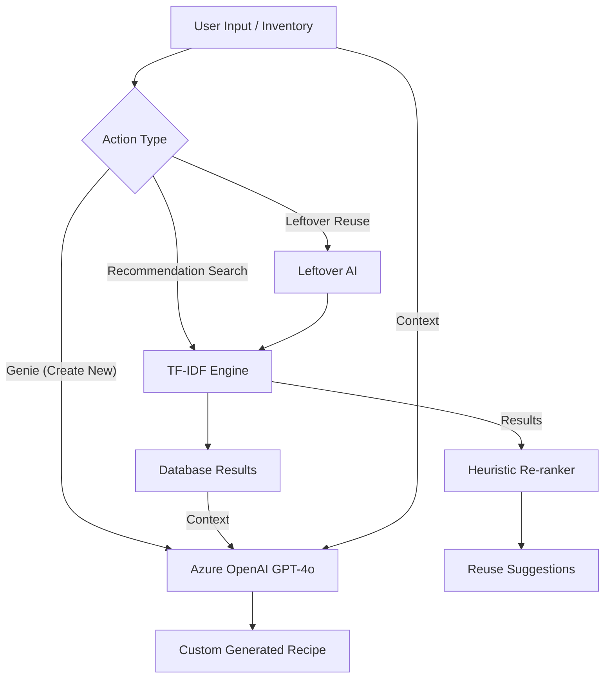

# 🤖 SmartMeal AI & Recommendation System

This document provides a deep dive into how the AI-powered features and the recommendation engine work in the SmartMeal system.

---

## 🏗️ Architecture Overview

The SmartMeal AI ecosystem is divided into three main layers:

1.  **Search & Retrieval (TF-IDF Engine)**: A high-performance, deterministic engine that matches user ingredients to a database of ~7,000 recipes.
2.  **Generative AI (Azure OpenAI)**: A "Chef Genie" that creates unique, context-aware recipes and provides conversational assistance.
3.  **Heuristic Re-ranking (Leftover AI)**: Specialized logic to minimize food waste by finding creative ways to reuse cooked leftovers.

---

## 🔍 1. The Recommendation Engine (TF-IDF)
**File**: `backend/app/services/recommendation.py`

This is the "brain" behind the **Recommendations Page**. Unlike a simple search, it understands ingredient importance.

### How it Works:
1.  **Data Preprocessing**:
    *   **Tokenization**: Ingredients are cleaned (lowercase, symbols removed).
    *   **Normalization**: Plurals are converted to singular (e.g., "tomatoes" → "tomato").
    *   **Synonym Mapping**: Regional terms are unified (e.g., "aubergine" → "eggplant", "coriander" → "cilantro").
2.  **TF-IDF Scoring**:
    *   **Term Frequency (TF)**: How often an ingredient appears in a recipe.
    *   **Inverse Document Frequency (IDF)**: How unique an ingredient is. Rare ingredients (like "saffron") carry more weight in matching than common ones (like "salt" or "water").
3.  **Weighted Ranking Algorithm**:
    The final score is a combination of:
    *   **Weighted Recall (58%)**: How many of your ingredients match the recipe, weighted by their IDF.
    *   **Raw Ratio (14%)**: The percentage of user ingredients present in the recipe.
    *   **Cosine Similarity (18%)**: Overall text similarity between the search query and the recipe content.
    *   **Metadata Bonus (10%)**: Boosts for matching user preferences like Cuisine, Diet (Veg/Non-Veg), and Cooking Time.

### 🌍 Multilingual Support
The system is globally aware. During the preprocessing phase (`preprocessing.py`):
-   **Automatic Detection**: The system scans for non-English scripts (Tamil, Hindi, etc.).
-   **Neural Translation**: Any non-English recipe content is automatically translated into English using Google Translate APIs before being indexed by the TF-IDF engine. This ensures a seamless search experience regardless of the original recipe's language.

---

## 🧞 2. Generative AI (Azure OpenAI)
**File**: `backend/app/services/ai_recipe_generator.py`

When the user clicks the **"Ask Genie to Create"** button, the system switches from *searching* to *creating*.

### Key Capabilities:
*   **Contextual Generation**: It doesn't just make a random recipe. It looks at the top results from the TF-IDF engine to see what "kind" of food the user was searching for and uses that as inspiration.
*   **Inventory Cross-Referencing**: The AI is fed the user's **Full Inventory**. It marks every ingredient in the generated recipe as "Available" or "Missing" based on what the user actually has.
*   **Smart Matching**: The prompt instructs the AI to ignore units and preparation methods during inventory checks (e.g., "2 large eggs" matches "egg").
*   **Shopping List Integration**: Any ingredient the AI determines is missing is automatically formatted into a shopping list for the user.

### Conversational AI:
*   **Recipe Chat**: Allows users to ask questions like "Can I swap chicken for tofu?" or "How do I make this spicier?" specifically about a generated recipe.
*   **SmartMeal Assistant**: A general-purpose bot that helps users navigate the app and suggests meal ideas based on their profile.

---

## 🥗 3. Leftover Reuse AI
**File**: `backend/app/services/leftover_ai.py`

This module is designed to combat food waste. It powers the **Leftover Tracker** reuse ideas.

### The Pipeline:
1.  **Ingredient Merging**: If a user selects "Leftover Rice" and "Leftover Chicken", the engine merges these into a single query list.
2.  **Deterministic Heuristics**: Before hitting the AI, it checks for "Classic Reuse Rules" (e.g., Rice → Fried Rice, Bread → Sandwich).
3.  **Re-ranking for Reuse**: It calls the TF-IDF engine but re-ranks the results. Recipes that use **all** selected leftovers are pushed to the top, even if their overall similarity score is lower.
4.  **Explanations**: It generates human-readable explanations: *"Recommended because it uses rice and chicken from your leftovers."*

---

## 🛠️ Technology Stack

| Feature | Tech/Library | Purpose |
| :--- | :--- | :--- |
| **Vectorization** | `scikit-learn` | TF-IDF Vectorizer & Cosine Similarity |
| **Data Processing** | `pandas` | Efficient handling of the recipe dataset |
| **Language Model** | `Azure OpenAI GPT-4o` | Structured JSON recipe generation & Chat |
| **Image Mapping** | Custom Logic | Dynamically assigns high-quality images based on cuisine/recipe name |
| **Frontend UI** | `React + Framer Motion` | Smooth animations for "thinking" states and result transitions |

---

## 🔐 Security & Optimization
*   **Lazy Loading**: The Azure OpenAI client is only initialized when needed, allowing the backend to run even if AI keys are missing.
*   **Caching**: TF-IDF artifacts (the matrix and vectorizer) are cached in memory after the first load to ensure sub-millisecond search speeds.
*   **Fail-safes**: If the Azure API is unreachable, the system automatically falls back to a deterministic "best match" from the local database.
